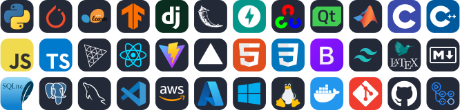
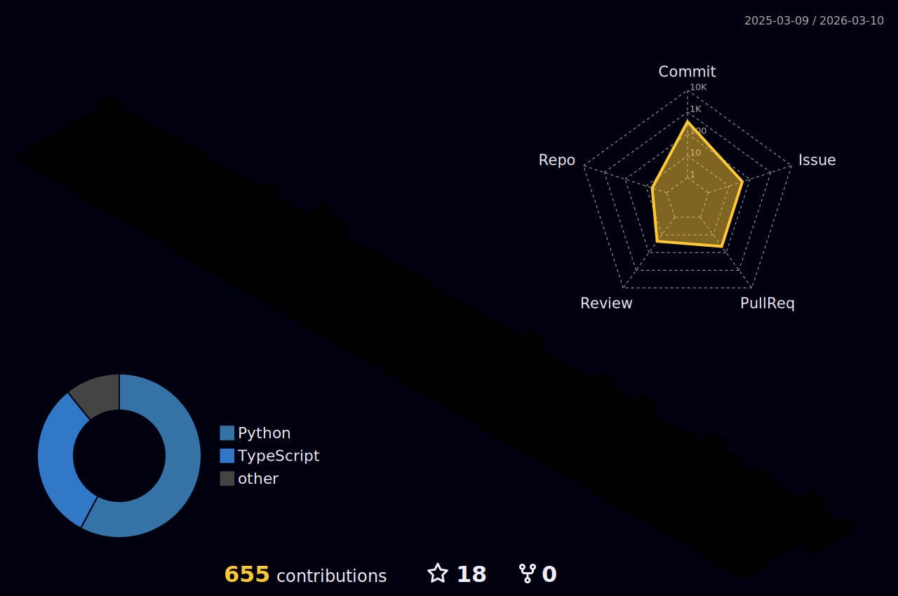

# 👨🏻‍🎓 [Yuya Suda](https://git-yuya.github.io/)

## 👋 Self Introduction
- 🗾 I'm from Tokyo, Japan.
- 🔭 I’m currently a master's student.
- 🌱 I'm interested in machine learning, generative AI, and cloud services.
- 🎈 I like working out, running and swimming.

## 💻 Skills

## 📈 Status

    
    
    <!--  -->
    
    

## 🚀 Projects

    
    
    
    
    
    
    
    
    
    
    <!--  -->
    
    
    
    
    
    
    
    

